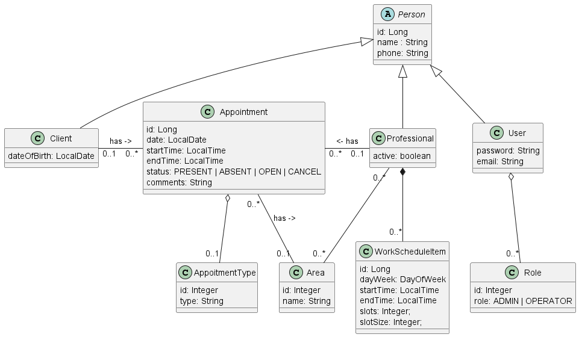
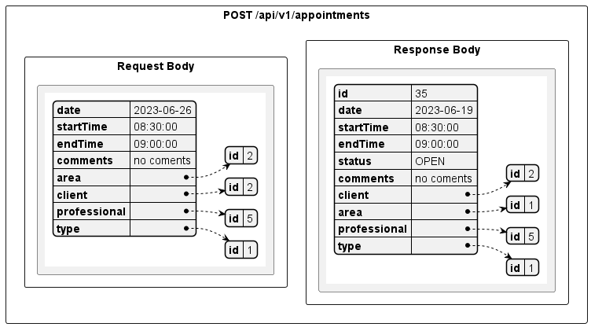

# Briefing Sistema de Agendamento: 

## Sistema de Agendamento de Consultas.
  - Uma clínica necessita controlar a agenda dos seus profissionais.
  - Todo o sistema de agendamento é feito por telefone somente pelos atendentes da clínica.
  - Essa primeira versão será implementado um MVP (Produto Mínimo Viável), dessa forma, atender somente as necessidades do MVP.
  - Existem diversas outras funcionalidades que serão implementadas nas versões futuras, assim que o MVP for validado pelo cliente.

## Requisitos da primeira versão (MVP):
  - O horário de funcionamento da clinica é das 8:00 às 12:00 e das 14:00 às 18:00. (Isso poderá mudar no futuro).
  - Cada profissional indica em quais dias da semana e horários ele vai trabalhar em intervalos de 30 minutos, das 08:00 às 11:30 e das 14:00 às 17:30 horas de segunda à sexta). (Isso poderá mudar no futuro).
  - Um profissional pode estar ativo ou desativo. 
  - Cada atendimento deve durar o tempo de 30 minutos e os horários de agendamento são intercalados a cada 30 minutos (das 08:00 às 12:00 e das 13:00 às 18:00 horas de segunda à sexta) (Isso poderá mudar no futuro).
  - O sistema não deve permitir agendar fora do horário e dias da semana de cada profissional.
  - O sistema não deve permitir agendar duas ou mais clientes no mesmo dia e horário de um profissional.
  - O sistema não deve permitir agendar o mesmo cliente no mesmo dia e horário.
  - O atendente pode cancelar um atendimento quando solicitado pelo cliente. Nas remover a consulta, apenas mudar o status.
  - O sistema deve controlar a frequência dos clientes (Presente ou Ausente).
  - Ao agendar uma consulta, selecionar primeiro a área e depois o profissional.
  - Agendar somente com profissionais ativos.
  - Não agendar no passado.
  - Não remover clientes com consultas ou sessões realizadas.
  - Não remover profissionais com consultas ou sessões realizadas.
  - Não remover Area e Tipo de Consulta com relacionamentos.
 
## Observações:
  - Manutencão do tipo de atendimento (particular, convenio1, convênio 2): tipo.
  - Manutencão de clientes: Nome, telefone e data de nascimento.
  - Manutencão de profissionais: Nome, telefone e data de nascimento, ativo e areas.
  - Manutencão de áreas: Nome.
  - Manutencão da disponibilidade do profissional. 
    - Ao mudar a disponibilidade de um professional, manter os agendamentos já realizados no futuro.
    - Ao desativar um profissional, manter os agendamentos já agendadas no futuro.
  - O agendamento deverá ter: cliente, profissional, área, tipo, comentários, data e horario de ínicio (validar todas as informações).
    - Mostrar a disponibiliade de datas e horários dentro de um mês.
    - Ao agendar uma consulta, confirmar o telefone do cliente selecionado.
  - Cancelar consultas profissionais. Ao cancelar uma consulta a mesma deve continuar no histórico do cliente. Somente a data e horário deve ser liberados para novos agendamentos.
  - Listar as consultas do dia da clínica, selecionando a área e o profissional. Essa opção deve permitir definir o cliente como ausente ou presente.
  - Listar o histórico de consultas de um cliente.
 
## Dois perfis:
   - Operador:
      - Permite fazer a manutenção de Clientes.
      - Permite agendar, cancelar e reagendar consultas.

   - Administrador: 
   Faz tudo que o operador.
      - Permite fazer a manutenção de novos usuários.
      - Permite fazer a manutenção de Tipo de Agendamento.
      - Permite fazer a manutenção de Areas.
      - Permite fazer a manutenção de Profissionais.
  
## Responsividade
  - Ter o layout correto para larguras de tela com 350px ou mais.
  - Não considerar larguras menores que 350px.

## Diagramas:
### Caso de Usos:

### Modelo Conceitual:

### End Points:

### End Point: POST \api\v1\appointments:

### Comandos:
Generate Diagrams: java -jar plantuml.jar -o "out" .

